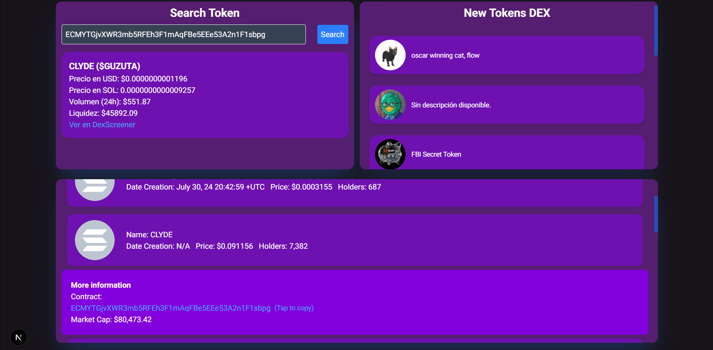
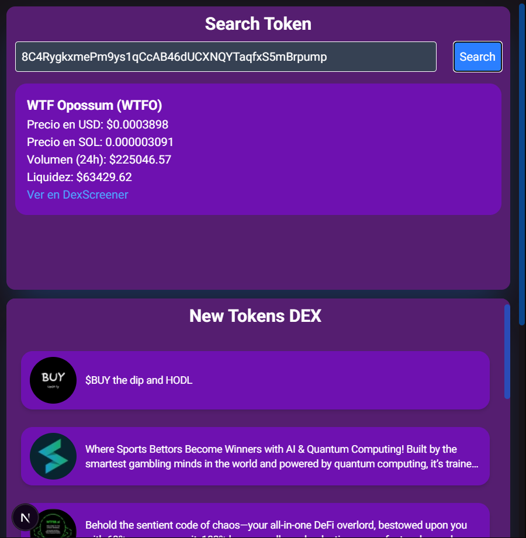
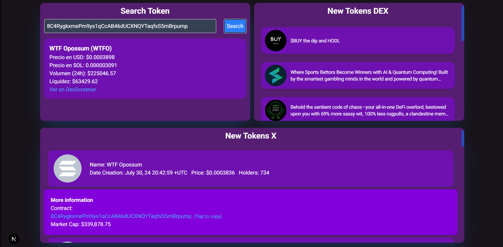

# Web Application for Twitter Scraping

This is a web application project in which I focus mainly on creatively testing scraping techniques for Twitter. Since X (Twitter) is not easily accessible unless using the X API, and on Nitter, the conventional and fast method of obtaining data from page tags does not work for pulling elements from the DOM, I opted to directly analyze the information by using automated navigation.

Additionally, I am experimenting with consuming the DEXScreener API to gather some external data and integrate it into the project.

---

## Screenshots

Here are some screenshots from the project:

---

### Technologies Used
- Twitter Scraping
- Automated Browsing
- DEXScreener API
- Web Development Technologies
